## O Que Veremos Neste Curso
1. [Instalação do Programa Estatístico `R`](#4)
1. [Instalação do Ambiente de Desenvolvimento Integrado (IDE) `R Studio`](#6)
1. [Executando o `R Studio`](#9)
1. [Instalação de Pacotes do `R` com o `R Studio`](#21)
1. [Tópicos Extra](#25)
    - *R Markdown*
    - *Controle de versão com Git*


# Instalação do Programa Estatístico `R`


## Instalação do Programa Estatístico `R`

- No Windows
    - Acesse no browser   
    <https://cran.r-project.org/bin/windows/base/>  
    e baixe o instalador adequado
- No Linux
    - Execute no terminal o comando  
       `sudo apt install r-recommended` 
- No Mac OS X
    - Acesse no browser    
    <https://cran.r-project.org/bin/macosx/>   
    e baixe o instalador adequado

**Abra a opção adequada para o seu laptop e vamos instalar!**


## Instalação do Programa Estatístico `R`

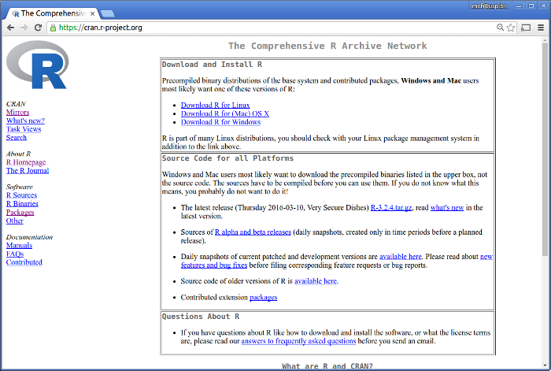


# Instalação do IDE `R Studio`


## Instalação do IDE `R Studio`

Acesse

<https://www.rstudio.com/>

ou

<https://www.rstudio.com/products/rstudio/download/>

e escolha a instalação adequada para o seu sistema operacional 
(Windows, Linux ou Mac OS X)


## Instalação do IDE `R Studio`

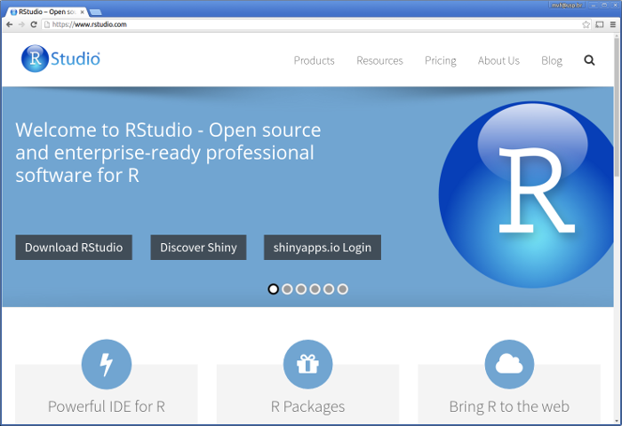


# Executando o R Studio


## R Studio

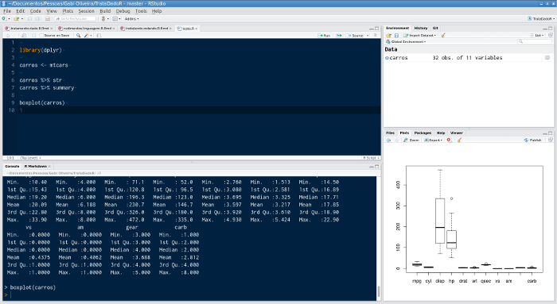


## Abas e Navegação no R Studio

1. Editando um *Script*
1. Executando Comandos no R
1. Executando um *Script*
1. Acessando o Help
2. Visualizando Gráficos
3. Inspecionando Variáveis
4. Histórico de Comandos 
5. Carregando Pacotes


## Editando um *Script*

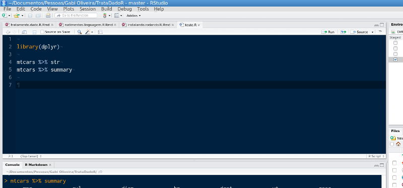


## Executando Comandos no R

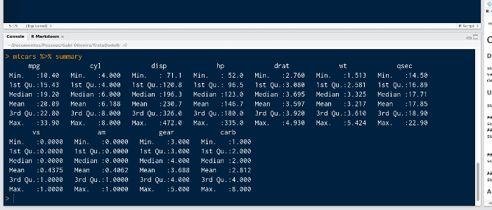

Digite na Aba `Console`
```{r}
2 + 2
```


## Executando um *Script*


## Executando um *Script*

Na janela de edição, 

- Para executar todo o script
    - clique no botão `Source` 
    - ou tecle `[Ctrl]` + `[Shift]` + `S`
- Para executar apenas algumas linhas do seu script,
    - selecione as linhas que você quer executar e tecle `[Ctrl]` + `[Enter]`


## Acessando o Help

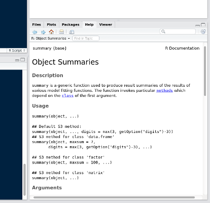


## Visualizando Gráficos

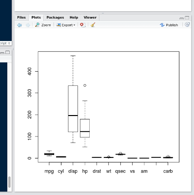


## Inspecionando Variáveis

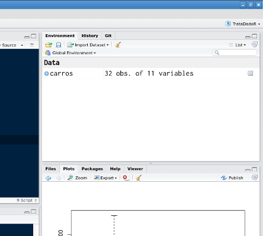


## Histórico de Comandos 

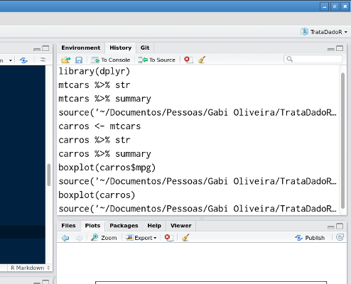


## Carregando Pacotes


# Instalação de Pacotes do `R` com o `R Studio`


## Instalação de Pacotes do `R` com o `R Studio`

Para instalar pacotes no R a partir do R Studio, 

1) entre na aba `Packages` na janela inferior esquerda,
2) clique no botão `Install` do painel da aba `Packages`
3) digite o(s) nome(s) do(s) pacote(s) na caixa de texto
`Packages (separate multiple with space or comma)` 
na janela de diálogo `Install Packages`
4) habilite a opção `Install dependencies`
5) clique no botão `Install`


## Instalação de Pacotes do `R` com o `R Studio`

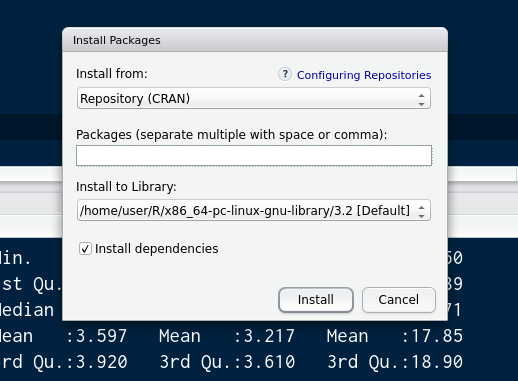


## Instalação de Pacotes do `R` com o `R Studio`

Instale os pacotes 

1. didáticos `swirl` e `Rcmdr`
2. de importação e exportação de dados `readxl`
3. de manuseio de dados `dplyr`, `tidyr`, `reshape`, `reshape2`, `lubridate`,
    `magrittr` e `car`


# Tópicos Extra


## *R Markdown*

Entre no menu `File > New File > R Markdown...` e crie um arquivo de 
apresentação (em *Presentation*) ou um documento HTML (em *Document*).

Eu criei esta apresentação com o R Markdown no R Studio.


## *R Markdown*

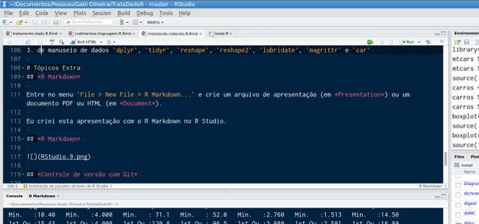


## *R Markdown*

Após a instalação, o R Studio suporte básico ao uso do R Markdown, para gerar 
documentos em HTML.

Contudo é possível gerar documentos PDF e DOCX também após a instalação de 
suporte adicional.

Para isso, é necessário instalar o pacote `knitR` do R e os softwares livres 
`pandoc` e `LaTeX`.


## *R Markdown*

<http://pandoc.org/installing.html>

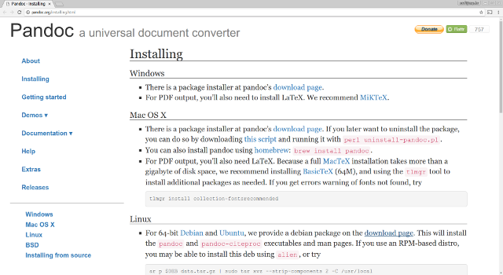


## *Controle de Versão com Git*

O seu programa funcionava direito com certeza até anteontem.

Ontem você fez algumas edições e o seu programa começou a se comportar estranho.

Você continuou editando e hoje, com certeza, o programa está funcionando errado.

Como reverter o seu programa de volta para a versão de anteontem, que funcionava 
direitinho, se ela já foi sobrescrita vez após vez ao longo de dois últimos 
dias?


## *Controle de Versão com Git*

Resposta: **Sistema de Controle de Versão!!!** 

<https://git-scm.com/>

<https://github.com/>

Separe um tempo para estudar isso.

Valerá a pena!


<!-- ********************************************************************* -->
#

 AQUI!!! 

Fazer um slide sobre instalação do git e do markdown no windows

No windows, não vem com a opção "Create git repository" em Create Project

No Linux

        sudo apt install git git-gui
        git gui

No Windows e OS X

        https://git-scm.com/downloads

já instala uma interface gráfica (GUI)

Pacote `installr` para instalar a partir do R, com as funções `install.git()`, 
`install.pandoc()`, `install.R()`
